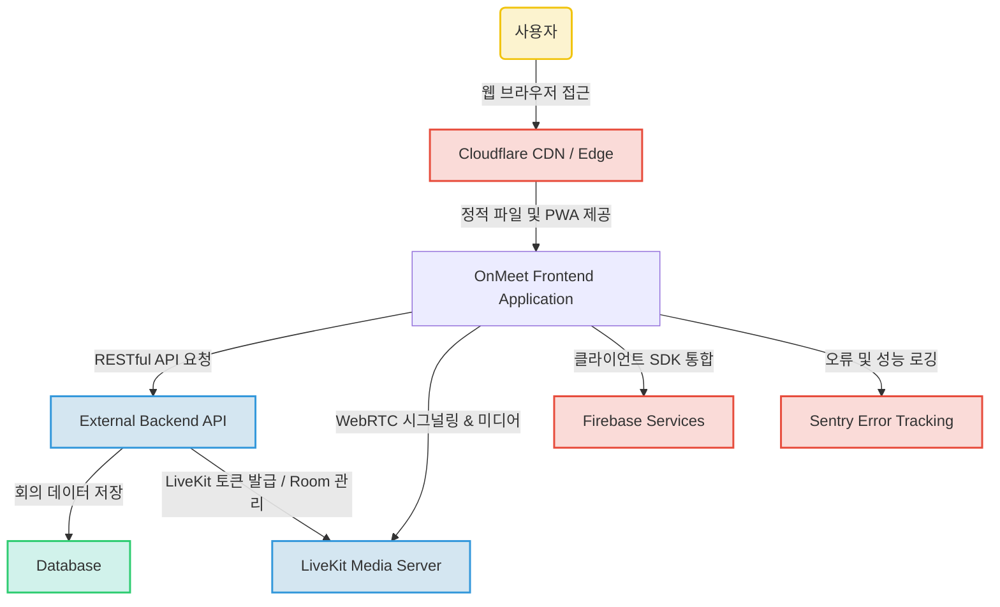

## OnMeet 프론트엔드 애플리케이션


[](https://www.typescriptlang.org/)
[](https://react.dev/)
[](https://vitejs.dev/)
[](https://tailwindcss.com/)
[](https://livekit.io/)

### 프로젝트 소개

`OnMeet` 프론트엔드 애플리케이션은 실시간 화상 및 음성 통신을 기반으로 한 협업 환경을 제공하는 웹 서비스입니다. 최신 웹 기술 스택(React, TypeScript, Vite)을 활용하여 개발되었으며, `LiveKit`을 통해 강력하고 안정적인 실시간 회의 기능을 구현했습니다. 사용자 인증, 회의실 관리, 실시간 미디어 처리, 클라이언트/서버 상태 관리, 다국어 지원 등 다양한 기능을 포함하며, 개발 생산성과 사용자 경험 최적화에 중점을 두었습니다. 본 프로젝트는 현대적인 웹 개발 트렌드를 반영하여 견고하고 확장 가능한 아키텍처를 구축하는 데 초점을 맞추고 있습니다.

### 주요 기능

본 프로젝트는 제공된 정보 및 코드 분석을 기반으로 다음과 같은 주요 기능을 포함하는 것으로 **추정**됩니다.

*   **사용자 인증 및 관리**: 회원가입, 로그인, 비밀번호 찾기, 토큰 갱신, 게스트 초대 등 사용자 인증과 관련된 다양한 기능을 제공합니다.
*   **실시간 화상/음성 회의**:
    *   `LiveKit`을 활용한 고품질의 실시간 화상 및 음성 통신 (WebRTC).
    *   참가자 관리, 화면 공유, 채팅 기능.
    *   개별 미디어(마이크, 카메라) 제어 (음소거/켜기).
    *   회의실 생성, 조회, 참여, 퇴장, 시작, 종료, 잠금 등의 회의실 라이프사이클 관리.
*   **클라이언트/서버 상태 관리**: `TanStack Query`를 통한 서버 데이터 캐싱 및 동기화, `Zustand`를 통한 효율적인 클라이언트 전역 상태 관리.
*   **대화형 UI 및 애니메이션**: `Radix UI`와 `Tailwind CSS`를 기반으로 접근성과 사용자 경험을 고려한 UI 구성, `Framer Motion`을 활용한 동적인 인터랙션 및 애니메이션.
*   **다국어 지원**: `i18next`를 통한 효율적인 다국어 처리로 글로벌 사용자 지원.
*   **PWA (Progressive Web App)** 지원: `VitePWA` 플러그인을 통해 오프라인 접근성, 홈 화면 추가 등 네이티브 앱과 유사한 사용자 경험 제공.
*   **AI 기반 회의 지원 (추정)**: 'AI 기반 회의록' 언급으로 미루어 음성 인식 및 요약 등 AI 관련 기능이 통합될 가능성이 있습니다.

### 프로젝트 구조

정확한 디렉토리 구조 설명이 제공되지 않았으나, 핵심 파일 설명을 기반으로 프로젝트는 다음과 같은 모듈화된 구조를 가질 것으로 **추정**됩니다.

```
.
├── .github/                       # GitHub Actions 워크플로우 정의
├── client/                        # 프론트엔드 애플리케이션 소스 코드
│   ├── app/                       # 애플리케이션의 주 진입점 및 전역 설정
│   │   ├── main.tsx               # React 애플리케이션 엔트리 포인트
│   │   └── ...
│   ├── features/                  # 특정 기능(feature)별 코드 모듈화
│   │   ├── auth/                  # 인증 관련 기능 (API, 컴포넌트, 훅 등)
│   │   ├── meeting/               # 회의실 관련 기능 (API, 훅, 상태 관리 등)
│   │   └── ...
│   ├── shared/                    # 여러 기능에서 공유되는 공통 유틸리티, 컴포넌트
│   │   ├── components/
│   │   ├── hooks/
│   │   ├── utils/                 # apiFetch.ts 등 공통 유틸리티
│   │   └── ...
│   ├── styles/                    # 전역 스타일 및 Tailwind CSS 설정
│   └── ...
├── public/                        # 정적 파일 (Favicon, manifest 등)
├── package.json                   # 프로젝트 메타 정보 및 의존성
├── vite.config.ts                 # Vite 빌드 설정
└── tsconfig.json                  # TypeScript 설정
```

*   `client/app`: 애플리케이션의 핵심 로직과 라우팅, 전역 컨텍스트 설정 등을 담당합니다.
*   `client/features`: 인증, 회의실 등 특정 도메인 또는 기능별로 코드를 분리하여 응집도를 높이고 독립적인 개발 및 유지보수를 용이하게 합니다.
*   `client/shared`: 여러 기능에서 재사용될 수 있는 공통 컴포넌트, 훅, 유틸리티 등을 모아두어 코드 중복을 최소화합니다.
*   `.github`: CI/CD (GitHub Actions) 워크플로우 정의 파일을 포함하여 자동화된 테스트 및 배포를 지원합니다.

### 핵심 파일 설명

프로젝트의 핵심 동작 및 구조를 이해하는 데 중요한 파일들은 다음과 같습니다.

*   **`package.json`**: 프로젝트의 메타 정보(이름, 버전)와 스크립트(개발, 빌드, 테스트)를 정의합니다. 특히 `@livekit/components-react`, `livekit-client`를 통한 실시간 통신, `@tanstack/react-query`를 통한 서버 상태 관리, `zustand`를 통한 클라이언트 상태 관리, `tailwindcss`와 `radix-ui`를 통한 UI 구성 등 주요 기술 스택을 파악할 수 있는 가장 기본적인 파일입니다.
*   **`vite.config.ts`**: Vite 빌드 도구의 설정 파일입니다. React 플러그인, PWA(`vite-plugin-pwa`) 설정, Cloudflare 배포 플러그인(`@cloudflare/vite-plugin`), 번들 최적화(`rollupOptions.output.manualChunks`), 코드 분석(`visualizer`) 등을 정의하여 개발 및 배포 환경을 최적화합니다. `@` 경로 별칭 설정도 여기서 이루어집니다.
*   **`client/app/main.tsx`**: React 애플리케이션의 주 진입점입니다. `ReactDOM.createRoot`를 사용하여 애플리케이션을 렌더링하고, 전역 스타일(`global.css`), 라우터, 테마 컨텍스트 등을 초기 설정하는 역할을 합니다.
*   **`client/features/auth/api/auth.ts`**: 사용자 인증과 관련된 다양한 API 호출 함수들(로그인, 회원가입, 비밀번호 찾기, 토큰 갱신, 게스트 초대 등)을 정의합니다. `authFetch` 유틸리티를 사용하여 백엔드와 통신하며, `buildFormData`를 통해 이미지 파일 업로드도 지원하는 것으로 보입니다.
*   **`client/features/meeting/api/room.ts`**: 회의실(Room)의 생성, 조회, 업데이트, 삭제, 참여, 퇴장, 시작, 종료, 잠금, 태그 관리 등 회의실 생명주기 및 관리에 필요한 모든 백엔드 API 연동 로직을 담당합니다.
*   **`client/features/meeting/hooks/useRoom.ts`**: `TanStack Query`를 활용하여 `room.ts`의 API 함수들을 React 컴포넌트에서 쉽게 사용할 수 있도록 캡슐화한 커스텀 훅 컬렉션입니다. 회의실 데이터의 캐싱, 백그라운드 갱신, 에러 처리 등을 자동화하여 개발 편의성을 높입니다.
*   **`client/features/meeting/store/useMeetingRoomStore.ts`**: `zustand`를 사용하여 회의실 내부의 클라이언트 측 상태를 중앙에서 관리합니다. 연결 상태(`phase`), 미디어 상태(음소거, 비디오 온/오프), UI 상태(전체 화면, 채팅/참가자 패널 표시), AI 녹화 상태, 채팅 메시지 등 실시간 회의의 동적인 상태들을 효율적으로 관리하며, `phaseMachine`을 통해 복잡한 상태 전이를 안정적으로 처리합니다.
*   **`client/shared/utils/apiFetch.ts`**: 모든 백엔드 API 호출의 기반이 되는 공통 유틸리티 파일입니다. `fetch` API를 래핑하여 인증 토큰을 포함한 요청, 공통 응답 형식(`{ success: true, data: T }`) 파싱, 에러 처리 등을 일관되게 수행합니다. `createServiceFetch` 팩토리 함수를 통해 서비스별(예: auth, room, ai) API 호출 함수를 생성합니다.
*   **`.github/workflows/ci.yml`**: GitHub Actions를 위한 CI 워크플로우를 정의합니다. Pull Request 또는 특정 브랜치에 푸시될 때마다 린트, 타입 체크, 단위 테스트를 실행하고, 성공 시 빌드 과정을 진행하여 코드 품질과 배포 안정성을 확보합니다.

### 기술 스택

**Frontend**

*   **React (`^18.3.1`)**: 컴포넌트 기반 UI 개발로 재사용성과 유지보수성을 높이고 개발 속도를 향상시킵니다.
*   **TypeScript (`^5.9.2`)**: 코드의 안정성을 높이고 대규모 애플리케이션 개발 시 오류를 줄여 생산성을 향상시킵니다.
*   **Vite (`^7.1.2`)**: 매우 빠른 개발 서버 구동과 번들링으로 개발 경험을 최적화하고 빌드 시간을 단축합니다.
*   **React Router DOM (`^6.30.1`)**: 선언적인 방식으로 SPA(Single Page Application)의 라우팅을 효율적으로 관리하고 사용자 경험을 개선합니다.
*   **TanStack Query (React Query) (`^5.84.2`)**: 서버 상태 관리와 캐싱을 자동화하여 데이터 동기화와 UI 업데이트를 간편하게 처리하고 사용자 체감 성능을 높입니다.
*   **Zustand (`^5.0.11`)**: 가볍고 유연한 전역 상태 관리 솔루션을 제공하여 컴포넌트 간 상태 공유를 효율적으로 만듭니다.
*   **LiveKit Client & Components React (`livekit-client ^2.17.2`, `@livekit/components-react ^2.9.20`)**: 실시간 화상 및 음성 통신(WebRTC) 기능을 쉽고 빠르게 통합하여 복잡한 미디어 처리를 추상화합니다.
*   **Tiptap (`^3.20.0`)**: 확장 가능한 WYSIWYG 리치 텍스트 편집기를 애플리케이션에 통합하여 사용자에게 풍부한 콘텐츠 작성 환경을 제공합니다.
*   **Tailwind CSS (`^3.4.17`)**: 유틸리티 우선 CSS 프레임워크로, 커스텀 디자인 시스템을 빠르고 일관되게 구축하며 CSS 작성량을 줄여줍니다.
*   **Radix UI (various versions)**: 접근성과 커스터마이징이 용이한 고품질의 재사용 가능한 UI 컴포넌트(헤드리스)를 제공하여 개발 생산성을 높입니다.
*   **Framer Motion (`^12.23.12`)**: 선언적 API를 통해 복잡한 UI 애니메이션과 인터랙션을 쉽게 구현하여 사용자 경험을 동적으로 만듭니다.
*   **i18next & React-i18next (`^25.10.3`, `^16.6.0`)**: 다국어 지원 기능을 효율적으로 구현하여 글로벌 사용자에게 접근성을 확대합니다.
*   **Zod (`^4.3.6`)**: 런타임에서 데이터 유효성 검사를 강력하게 수행하여 애플리케이션의 안정성과 신뢰성을 높입니다.
*   **Recharts (`^2.12.7`)**: 선언적인 React 컴포넌트 기반으로 다양한 차트와 그래프를 시각화하여 데이터 분석 기능을 강화합니다.
*   **Firebase (`^12.10.0`)**: 인증, 분석 등 다양한 백엔드 기능을 클라이언트에서 쉽게 연동하여 개발 부담을 줄이고 서비스 확장을 용이하게 합니다.
*   **Sentry (`^10.40.0`)**: 애플리케이션의 런타임 오류를 실시간으로 모니터링하고 분석하여 문제 해결 시간을 단축하고 사용자 경험을 개선합니다.
*   **VitePWA (`^1.2.0`)**: 웹 애플리케이션을 프로그레시브 웹 앱(PWA)으로 전환하여 오프라인 지원, 푸시 알림 등 네이티브 앱과 유사한 경험을 제공합니다.

**Backend (Implicit & External)**

*   **External RESTful API Server (Implicit)**: 프론트엔드와 분리된 마이크로서비스 또는 모놀리식 아키텍처를 통해 비즈니스 로직과 데이터 처리를 담당하여 시스템의 확장성과 안정성을 보장합니다.
*   **LiveKit Server (Implicit)**: 실시간 화상 및 음성 통신을 위한 서버 측 인프라를 제공하여 WebRTC 연결, 미디어 처리 및 스트리밍을 안정적으로 지원합니다.

**DevOps & Tools**

*   **Cloudflare (Wrangler CLI `^4.76.0`)**: CDN, 엣지 컴퓨팅 및 강력한 보안 기능을 통해 웹 애플리케이션의 성능을 최적화하고 안정적인 배포 환경을 제공합니다.
*   **GitHub Actions**: 자동화된 CI/CD 파이프라인을 구축하여 코드 변경 시마다 빌드, 테스트, 배포 과정을 자동으로 실행하여 개발 워크플로우 효율성을 높입니다.
*   **Vitest (`^3.2.4`)**: 빠르고 현대적인 테스트 프레임워크로 단위 및 통합 테스트를 신속하게 실행하여 코드 품질을 확보하고 회귀를 방지합니다.
*   **Playwright (`^1.58.2`)**: 다양한 브라우저에서 엔드투엔드(E2E) 테스트를 안정적으로 자동화하여 사용자 시나리오에 따른 기능 검증 신뢰도를 높입니다.
*   **ESLint (`^10.1.0`)**: 코드 품질과 일관성을 유지하기 위해 코드 스타일 및 잠재적 오류를 자동으로 검사하여 개발 표준 준수를 돕습니다.
*   **Prettier (`^3.6.2`)**: 일관된 코드 포맷팅을 자동으로 적용하여 코드 가독성을 높이고 코드 리뷰 시간을 단축합니다.

### 시스템 아키텍처

OnMeet 프론트엔드 애플리케이션은 React, TypeScript, Vite를 기반으로 구축된 현대적인 SPA(Single Page Application)입니다. `TanStack Query`와 `Zustand`를 통해 서버 및 클라이언트 상태를 효율적으로 관리하며, `LiveKit`을 활용하여 강력한 실시간 화상 회의 기능을 제공합니다. UI는 `Tailwind CSS`와 `Radix UI` 컴포넌트를 사용하고 `Framer Motion`으로 동적인 인터랙션을 구현했습니다. 외부 RESTful API 서버와 통신하여 인증, 회의 관리 등 백엔드 로직을 처리하며, `Firebase`와 `Sentry`를 통합하여 추가적인 서비스(분석, 오류 추적)를 활용합니다. `Cloudflare`를 통해 배포 및 캐싱이 이루어지며, `GitHub Actions`로 CI/CD를 자동화하여 개발 워크플로우를 최적화했습니다.

다음은 시스템 아키텍처의 개요를 나타내는 다이어그램입니다.



### 실행 방법

이 프로젝트의 실행 방법에 대한 정보는 제공되지 않았습니다. 일반적으로 React/Vite 기반 프로젝트는 다음 단계를 따릅니다.

1.  **Node.js 설치**: 프로젝트가 요구하는 Node.js 버전(보통 `package.json`에 명시)을 설치합니다.
2.  **의존성 설치**: 프로젝트 루트 디렉토리에서 다음 명령어를 실행하여 모든 의존성 패키지를 설치합니다.
    ```bash
    npm install
    # 또는
    yarn install
    # 또는
    pnpm install
    ```
3.  **환경 변수 설정**: 백엔드 API 엔드포인트, LiveKit 서버 URL, Firebase 설정 등 필요한 환경 변수를 `.env` 파일에 설정해야 할 수 있습니다. (예: `.env.local` 파일 생성)
4.  **개발 서버 실행**: 다음 명령어를 실행하여 개발 서버를 시작합니다.
    ```bash
    npm run dev
    # 또는
    yarn dev
    # 또는
    pnpm dev
    ```
5.  **웹 브라우저 접속**: 터미널에 표시되는 URL(일반적으로 `http://localhost:5173`)로 접속하여 애플리케이션을 확인할 수 있습니다.

**추가 작성 필요**: 백엔드 서버 실행 방법 및 필요한 설정(API Key, LiveKit Secret 등)에 대한 구체적인 정보가 필요합니다.

### 기술 선택 이유

*   **React & TypeScript**: React의 컴포넌트 기반 아키텍처는 UI 개발의 재사용성과 효율성을 높이며, TypeScript는 정적 타입 검사를 통해 대규모 애플리케이션의 안정성과 유지보수성을 크게 향상시킵니다.
*   **Vite**: 개발 서버의 빠른 구동과 HMR(Hot Module Replacement)은 개발 경험을 최적화하고, Rollup 기반의 번들링은 배포 시 최적화된 결과물을 제공하여 빌드 시간을 단축합니다.
*   **TanStack Query (React Query)**: 서버 상태 관리를 선언적으로 처리하고, 캐싱, 백그라운드 데이터 갱신, 에러 처리 등을 자동화하여 개발 복잡도를 줄이고 사용자 체감 성능을 개선합니다.
*   **Zustand**: 가벼운 훅 기반의 전역 상태 관리 라이브러리로, 최소한의 보일러 플레이트 코드로 유연하고 효율적인 클라이언트 상태 관리를 가능하게 합니다.
*   **LiveKit Client & Components React**: WebRTC 기반의 실시간 화상/음성 통신 기능을 쉽고 빠르게 애플리케이션에 통합할 수 있도록 도와주며, 미디어 처리의 복잡성을 추상화하여 개발 생산성을 높입니다.
*   **Tailwind CSS & Radix UI**: Tailwind CSS는 유틸리티 클래스를 사용하여 빠르고 일관된 디자인 시스템을 구축하며, Radix UI는 접근성을 고려한 헤드리스 컴포넌트를 제공하여 유연한 UI 커스터마이징을 가능하게 합니다.
*   **Framer Motion**: 선언적인 API를 통해 복잡한 UI 애니메이션과 상호작용을 간편하게 구현하여 사용자 경험을 동적이고 매끄럽게 만듭니다.
*   **Zod**: 런타임 데이터 유효성 검사를 위한 스키마 정의를 제공하여, 외부에서 들어오는 데이터의 신뢰성을 확보하고 애플리케이션의 안정성을 높입니다.
*   **VitePWA**: 웹 애플리케이션에 PWA 기능을 쉽게 추가하여 오프라인 지원, 푸시 알림, 홈 화면 설치 등 네이티브 앱과 유사한 사용자 경험을 제공합니다.
*   **GitHub Actions**: 코드 변경 시마다 자동으로 테스트, 린트, 빌드 등의 CI 과정을 수행하여 코드 품질을 지속적으로 관리하고, CD를 통해 배포 프로세스를 자동화하여 개발 효율성을 극대화합니다.
*   **Vitest & Playwright**: Vitest는 빠르고 모던한 단위/통합 테스트 환경을 제공하여 개발 단계에서 버그를 조기에 발견하며, Playwright는 다양한 브라우저에서의 안정적인 E2E 테스트를 통해 실제 사용자 시나리오 기반의 기능 검증을 보장합니다.

### 개선 방향

제공된 정보를 바탕으로 다음과 같은 개선 방향을 고려할 수 있습니다. 이는 프로젝트의 잠재적 성장과 안정성 향상에 기여할 것입니다.

1.  **백엔드 아키텍처 상세 문서화**: 현재 프론트엔드 코드에서 여러 마이크로서비스(인증, 회의실, AI 등) 호출이 `API Gateway`를 통해 이루어지는 것으로 **추정**됩니다. 백엔드 서비스 간의 관계, API Gateway의 역할, 데이터 흐름 등을 명확히 문서화하여 시스템 전체에 대한 이해도를 높여야 합니다.
2.  **AI 기능의 구체화 및 확장**: 'AI 기반 회의록'이라는 기능이 언급되었으나, 어떤 AI 기술(음성 인식, 자연어 처리, 요약, 번역 등)이 어떻게 통합되어 결과를 제공하는지에 대한 상세 구현 계획이 필요합니다. 이를 통해 AI 기능의 고도화 및 확장 가능성을 탐색할 수 있습니다.
3.  **LiveKit 서버 인프라 관리**: LiveKit 클라이언트 라이브러리를 사용하고 있으므로, LiveKit 미디어 서버(SFU)의 배포, 확장, 모니터링 및 고가용성 확보 방안에 대한 구체적인 계획이 필요합니다. 클라우드 기반 관리형 서비스 활용 또는 자체 구축 및 운영 전략을 수립할 수 있습니다.
4.  **종합적인 CI/CD 파이프라인 구축**: `GitHub Actions`를 통한 CI는 구현되어 있으나, 빌드 후 **자동 배포(CD)** 전략(예: Cloudflare Pages/Workers와의 연동)을 워크플로우에 통합하여 전체 배포 과정을 완전히 자동화할 수 있습니다. 이를 통해 개발 및 배포 주기를 단축하고 안정성을 높일 수 있습니다.
5.  **상태 관리 경계 명확화 및 문서화**: `Zustand`와 `TanStack Query`를 함께 사용하는 상황에서, 각 라이브러리가 담당하는 상태의 범위와 책임(클라이언트 UI 상태 vs. 서버 데이터 상태)을 명확히 정의하고 문서화하여 개발 팀의 혼란을 줄이고 일관된 상태 관리 패턴을 유지해야 합니다. 특히 `useMeetingRoomStore`의 `phaseMachine`과 같은 복잡한 상태 전이 로직에 대한 상세 설명이 유용할 것입니다.
6.  **성능 최적화 및 로딩 전략**: 초기 로딩 속도 최적화를 위해 코드 스플리팅, 이미지 최적화, 불필요한 리소스 로딩 지연 등을 더 적극적으로 고려하고, Web Vitals 지표를 기준으로 성능을 지속적으로 모니터링하고 개선해야 합니다.
7.  **에러 핸들링 및 모니터링 강화**: `Sentry`를 통해 오류 추적을 하고 있으나, 에러 발생 시 사용자에게 친화적인 피드백 제공, 에러 로깅 정책 구체화, 비정상적인 동작 감지 및 알림 시스템 구축 등 전반적인 에러 핸들링 전략을 강화할 수 있습니다.
8.  **테스트 커버리지 확장**: `Vitest` 및 `Playwright`를 통해 테스트가 진행되지만, 주요 기능 및 엣지 케이스에 대한 단위, 통합, E2E 테스트 커버리지를 더욱 확장하여 코드 변경에 따른 회귀를 방지하고 시스템의 신뢰성을 높여야 합니다.